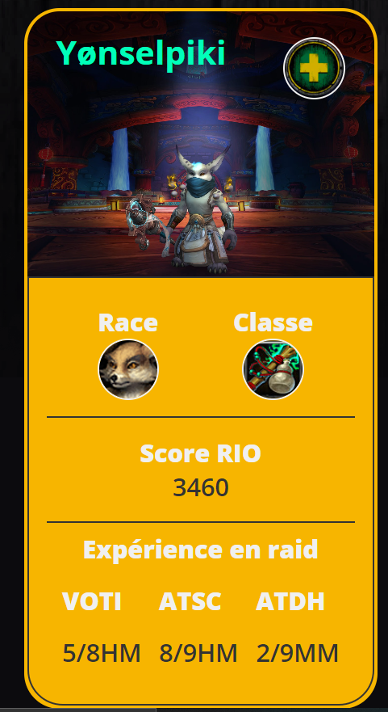

# theCollection
 
 Lien vers la GitHub page : 
 https://happyfeys.github.io/laCollection/

# Consignes : 

Les consignes étaient d'approfondir et de maitriser les concepts que l'on avait vu auparavant : 
    - HTML & CSS
    - Responsives design
    - JavaScript Basic
    - The DOM

Le projet devait contenir une collection d'objet et ne pas passer par une API. 

En bonus, nous avions la possibilité de créer un système de tri, une fonctionnalité de suppression. 

# Mon projet : 

Etant joueur et officier d'une guilde sur World Of Warcraft, j'ai décidé de faire une page reprenant tout les membres actifs de celle-ci.

Mon objectif était d'avoir un visuel rapide sur les membres ainsi que quelques informations utiles.

# Chose à continuer

A l'heure actuelle, toutes les fonctions de création de carte, de tri, de suppression sont fonctionnelles. Cependant, il reste quelques soucis à régler.
Par exemple, lorsque l'utilisateur veut trier, il lui est impossible de supprimer une card. Si il supprime une card d'abord, puis veut trier, toutes les cards supprimées réapparaissent. 

On pourrait également refactoriser la fonction CreateCard en plusieurs fonctions, diviser pour mieux régner.

